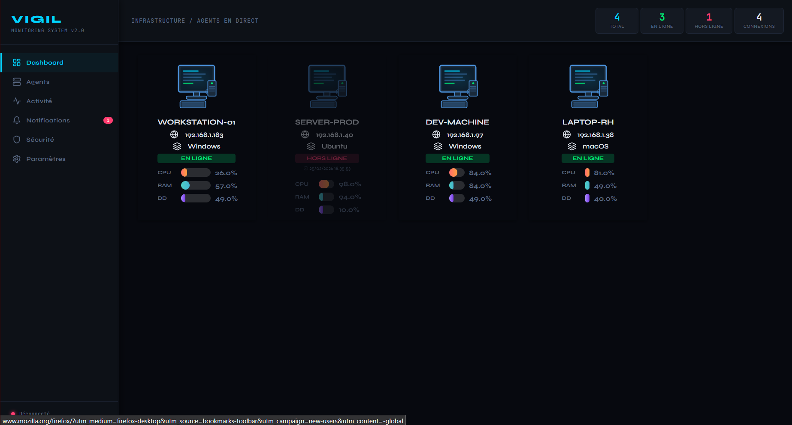

# 🌐 VIGIL — Site de Présentation

> Site vitrine officiel de **VIGIL**, le système de monitoring centralisé open-source pour surveiller plusieurs machines en temps réel.

---

## 📖 À propos

Ce dépôt contient le **site de présentation de VIGIL** — une page web statique conçue pour présenter le projet, ses fonctionnalités et guider les utilisateurs vers l'installation.

> 🔗 **Outil principal :** [github.com/christ20351/VIGIL](https://github.com/christ20351/VIGIL)

---

## ✨ Ce que présente le site

- **Vue d'ensemble** du projet VIGIL et de son architecture
- **Fonctionnalités clés** : monitoring CPU, RAM, réseau, processus en temps réel
- **Captures d'écran** du dashboard interactif
- **Guide de démarrage rapide** pour Windows et Linux
- **Liens de téléchargement** et accès au dépôt GitHub

---

## 🛠️ Stack technique

| Technologie | Rôle |
|-------------|------|
| Nextjs | Realisation des UI |

Pas de framework, pas de build tool — **léger et rapide** par conception.

---

## 📸 Aperçu

---

## 🔗 Liens utiles

| Lien | Description |
|------|-------------|
| [Dépôt principal VIGIL](https://github.com/christ20351/VIGIL) | Code source de l'outil |
| [Guide d'installation](../INSTALL.md) | Installer VIGIL sur vos machines |
| [Releases](https://github.com/christ20351/VIGIL/releases/latest) | Télécharger la dernière version |

---

## 🤝 Contribuer

Les contributions sont les bienvenues ! Pour proposer des améliorations au site :

1. Forkez le dépôt
2. Créez une branche : `git checkout -b feat/amélioration-site`
3. Commitez vos changements : `git commit -m "feat: amélioration du site"`
4. Ouvrez une Pull Request

---

  Fait avec ❤️ pour le projet <strong>VIGIL</strong>

